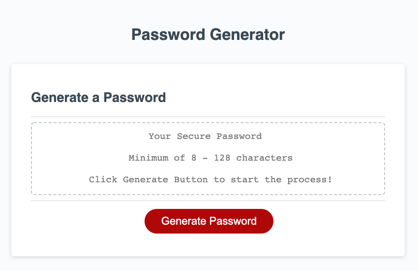

# Password-Generator.github.io
This app consists of HTML, CSS & Javascript to run a password generator. When clicking the "Generate Password" button a prompt will pop up asking for the character length, right after choosing the length a Numbers, Special characters, upper case & lower case alerts will pop up asking if any of these will be included in the password. When completed through the steps the password will be generated and showed in the "Your secured Password" field.

Link: https://banda-adrian.github.io/Password-Generator.github.io/

